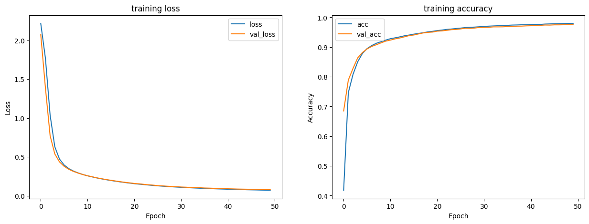
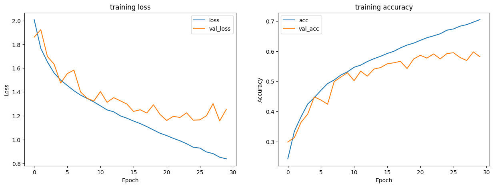

# My Neuro Network Practice Repository
## PyTorch
### Mnist
#### CNN
- model structure :
```
----------------------------------------------------------------
        Layer (type)               Output Shape         Param #
================================================================
            Conv2d-1         [1000, 16, 28, 28]             416
              ReLU-2         [1000, 16, 28, 28]               0
         MaxPool2d-3         [1000, 16, 14, 14]               0
            Conv2d-4         [1000, 32, 14, 14]          12,832
              ReLU-5         [1000, 32, 14, 14]               0
         MaxPool2d-6           [1000, 32, 7, 7]               0
            Linear-7                 [1000, 10]          15,690
================================================================
Total params: 28,938
Trainable params: 28,938
Non-trainable params: 0
----------------------------------------------------------------
Input size (MB): 2.99
Forward/backward pass size (MB): 323.07
Params size (MB): 0.11
Estimated Total Size (MB): 326.18
----------------------------------------------------------------
```
- train history

- accuracy : 0.975

### Cifar10
#### CNN
- model structure :
```
----------------------------------------------------------------
        Layer (type)               Output Shape         Param #
================================================================
            Conv2d-1          [256, 32, 32, 32]           2,432
            Conv2d-2          [256, 32, 32, 32]          25,632
       BatchNorm2d-3          [256, 32, 32, 32]              64
           Dropout-4          [256, 32, 32, 32]               0
              ReLU-5          [256, 32, 32, 32]               0
         MaxPool2d-6          [256, 32, 16, 16]               0
            Conv2d-7          [256, 64, 16, 16]          51,264
            Conv2d-8          [256, 64, 16, 16]         102,464
       BatchNorm2d-9          [256, 64, 16, 16]             128
          Dropout-10          [256, 64, 16, 16]               0
             ReLU-11          [256, 64, 16, 16]               0
        MaxPool2d-12            [256, 64, 8, 8]               0
          Flatten-13                [256, 4096]               0
           Linear-14                [256, 1600]       6,555,200
          Dropout-15                [256, 1600]               0
             ReLU-16                [256, 1600]               0
           Linear-17                 [256, 512]         819,712
          Dropout-18                 [256, 512]               0
             ReLU-19                 [256, 512]               0
           Linear-20                 [256, 128]          65,664
          Dropout-21                 [256, 128]               0
             ReLU-22                 [256, 128]               0
           Linear-23                  [256, 32]           4,128
          Dropout-24                  [256, 32]               0
             ReLU-25                  [256, 32]               0
           Linear-26                  [256, 10]             330
================================================================
Total params: 7,627,018
Trainable params: 7,627,018
Non-trainable params: 0
----------------------------------------------------------------
Input size (MB): 3.00
Forward/backward pass size (MB): 525.33
Params size (MB): 29.09
Estimated Total Size (MB): 557.43
----------------------------------------------------------------
```
- train history :

- accuracy : 0.582
## Tensorflow